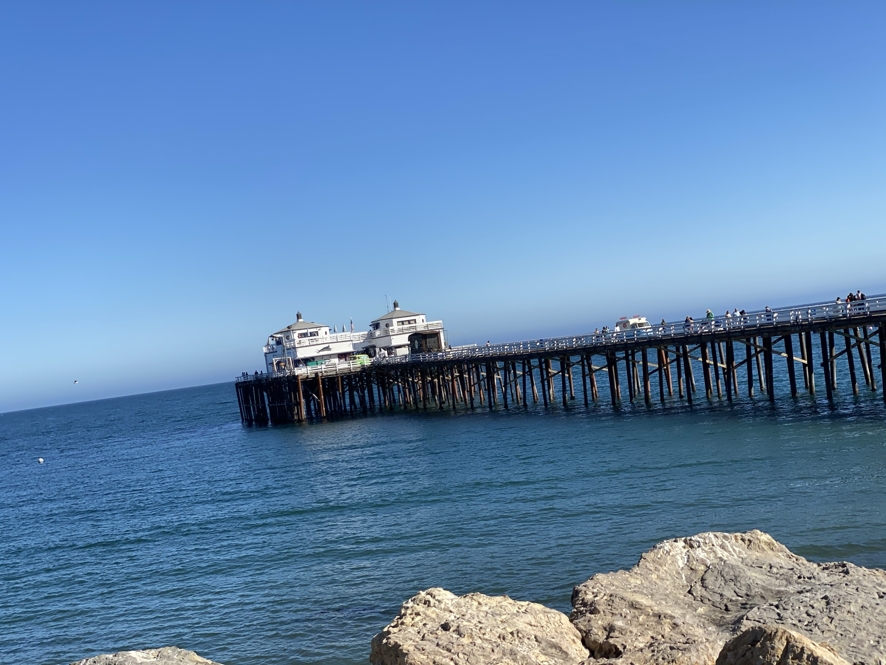

<!DOCTYPE html>

<html>
  <HEAD>
    <link href="./css/custom_bootstrap.css" rel="stylesheet"/>
  <sytle>

  </sytle>
</HEAD>
 
<body>

This is a paragraph.

This is another paragraph.

<h1>My First Heading</h1>

My first paragraph.

  

    
  

</body>
</html>
